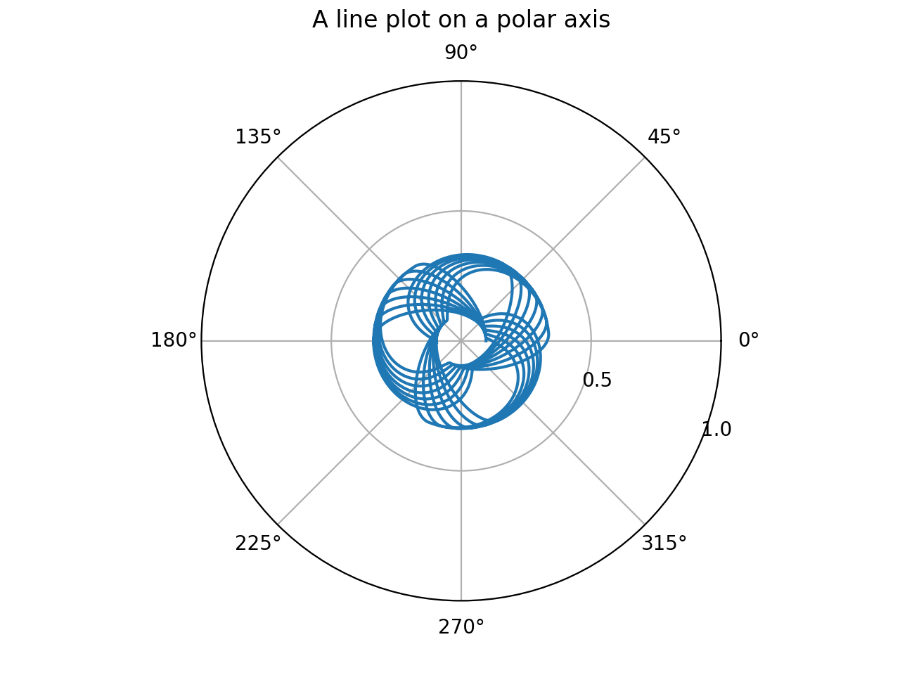

# toy_model_for_gravitational_wave
This is a computational approach to visualise and simulate the gravitational wave using the fabric. 

The code implements a simulation of a fabric sheet that is wrapped around a sphere, with the goal of finding its height profile along the sphere's circumference. 

Here is a brief description of each function in the code: 

**obtain_root**: This function finds the roots of a quartic equation (a fourth-degree polynomial equation) using Ferrari's Method. It takes a polynomial equation represented by an array of its coefficients as input, and returns an array of its roots (returns an array of 4 roots). 

**get_beta**: This function computes the value of beta for each radial point on the sphere's circumference. beta is a function of the radius, the sphere's mass, and a parameter alpha. 

**gen_fabric_slope**: This function computes the slope of the fabric sheet at each radial point on the sphere's circumference. The slope is a function of beta and the root number. 

**read_fabric_slope**: This function reads the slope of the fabric sheet from a file. 

**fabric_height**: This function computes the height of the fabric sheet at each radial point on the sphere's circumference. It uses the slope information, the radial points, and a step size to compute the height profile. 

**Effective_Potential**: This function computes the effective potential energy at each radial point on the sphere's circumference. 

main: This function is the main function that calls all the other functions and performs the simulation. It sets the initial conditions, parameters, and inputs, and outputs the final result. 

The Simulation function performs the main simulation, updating the position and velocity of the ball at each time step, until it reaches the end of the simulation time or reaches the edge of the fabric sheet.

Finally, the **plot_trajectory** function plots the trajectory of the ball on the fabric sheet.

